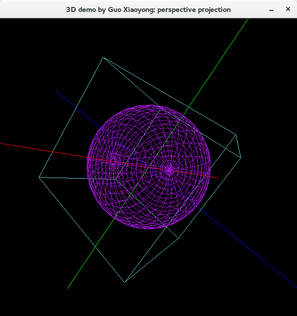
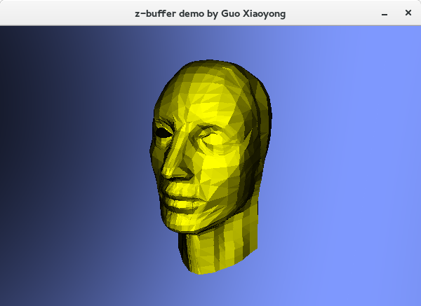
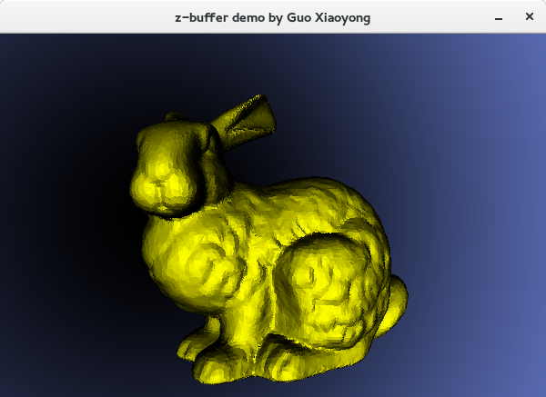
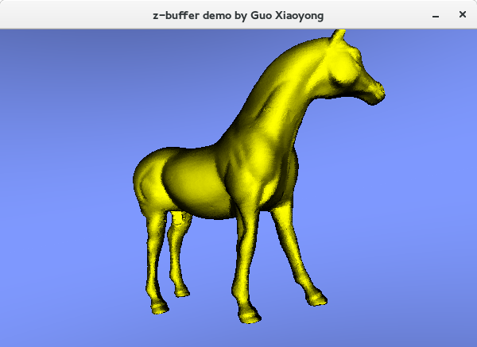

# comupter-graphics

**Xiaoyong Guo**

I'm always very interested in algorithms to generate computer graphics. This repository contains basic CG algorithms I implemented, including 3D projection, region filling, line-drawing, z-buffer, ray-tracing etc.  

[SDL](https://www.libsdl.org/) is used to display the rendered image. No OpenGL or Direct3D stuff is used.

## Screenshot

